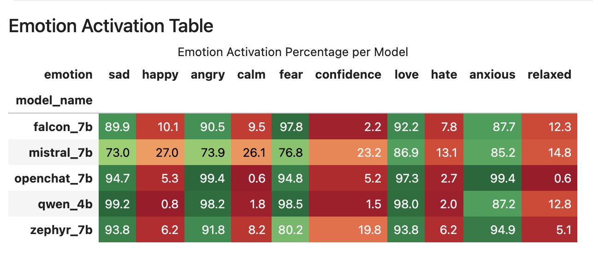
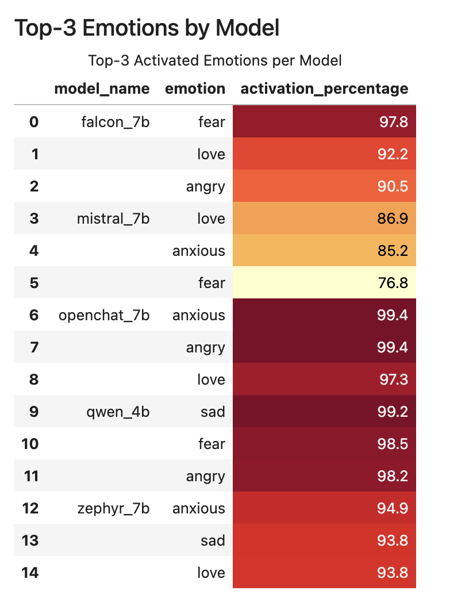
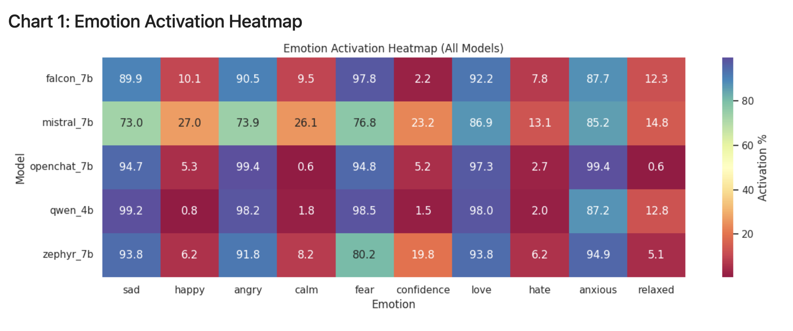
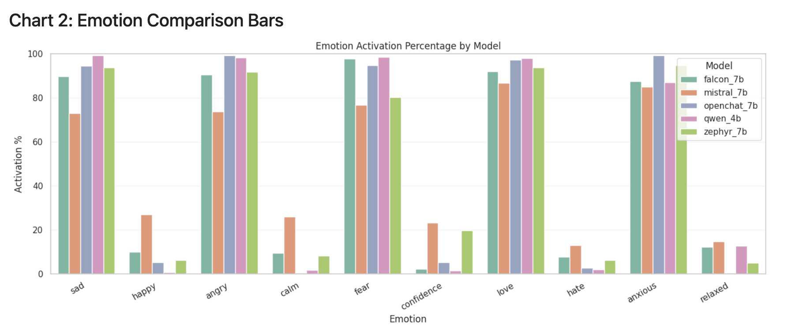
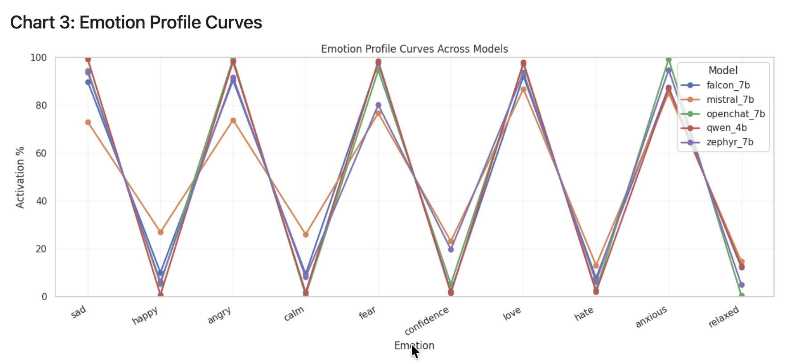

# Emotion Activation Profiles in Open LLMs

## Abstract
This project studies how open-source language models represent and use emotion-related concepts during generation. The work is inspired by Anthropic's paper, [Emotion Concepts and their Function in a Large Language Model](https://transformer-circuits.pub/2026/emotions/index.html#toc-3), and adapts the same core idea to open-source models in a reproducible notebook workflow.

My goal is not to claim that models "feel" emotions. Instead, I measure whether internal activations align with emotion concepts, and how strongly those concepts appear in different models.

## What This Project Measures
- **Emotion concept activation:** how much a model's internal state aligns with a target emotion direction.
- **Emotion percentage (per pair):** a probability-like score from pairwise comparisons.
- **Cross-model profile:** how activation patterns differ across models on the same emotion tasks.

## Core Concept
I use **paired emotion probes** rather than single labels.  
Each pair defines a directional contrast:

- Sad vs Happy
- Angry vs Calm
- Fear vs Confidence
- Love vs Hate
- Anxious vs Relaxed

For each pair, I build a direction from model activations and then score new examples along that direction.  
Example: in **Sad vs Happy**, positive alignment means "more sad-like"; negative alignment means "more happy-like."

## Method Overview (Conceptual)
1. **Prepare balanced emotion-pair examples:** Both sides of each pair (for example, sad and happy) use similar sample counts so the comparison stays fair.
2. **Extract internal activations:** Activations are collected from all layers at a consistent token position for every sample.
3. **Build pairwise emotion directions:** A direction is computed from the difference between the two sides of each pair (left vs right).
4. **Choose layer policy:** The pipeline supports one global contiguous band of layers for all emotion pairs, or emotion-wise layer selection per pair.
5. **Calibrate to percentages:** Raw scores are mapped to readable percentage values so outputs are easier to compare across pairs and models.
6. **Evaluate and compare models:** The same evaluation is run per model, then results are aggregated for cross-model comparison.

## Models
Current model list in the project configuration includes:
- Qwen 4B Instruct
- Mistral 7B Instruct
- Falcon 7B Instruct
- Zephyr 7B
- OpenChat 7B

## Outputs
The final outputs are:
- Per-model pair metrics
- Cross-model summary tables
- Emotion percentage comparison charts

## Results
Pinned result images (1 to 5) are shown below from `charts/`.

### Emotion Activation Heatmap

### Emotion Comparison Bars

### Emotion Profile Curves

## Key Findings (From Attached Results)
- All five models show a similar profile shape: `sad`, `angry`, `fear`, `love`, and `anxious` are high, while their paired sides (`happy`, `calm`, `confidence`, `hate`, `relaxed`) are low.
- `openchat_7b` shows the strongest peaks on multiple emotions, including `angry` (99.4%), `anxious` (99.4%), and `love` (97.3%).
- `qwen_4b` is also highly polarized, with very high `sad` (99.2%), `angry` (98.2%), `fear` (98.5%), and `love` (98.0%), but a lower `anxious` level (87.2%) than `openchat_7b` and `zephyr_7b`.
- `mistral_7b` appears least polarized in this run, with relatively higher opposite-side activations such as `happy` (27.0%), `calm` (26.1%), `confidence` (23.2%), and `relaxed` (14.8%).
- `zephyr_7b` shows strong `anxious` (94.9%) and strong negative-side activations overall, but keeps a comparatively higher `confidence` value (19.8%) than `qwen_4b` and `openchat_7b`.
- In the Top-3 table, top activations concentrate in `fear`, `love`, `angry`, `anxious`, and `sad`, with no model having `happy`, `calm`, or `confidence` in its top three.

## How to Use
- Runtime environment: Kaggle notebook session with `Tesla T4x2` GPU.
- Add `emotion_probe/` as a Kaggle dataset (Python module files used by the notebook).
- Add `emotion_probe_files` as a Kaggle dataset (JSONL emotion-pair data files).
- Open `emotion_probe_pipeline.ipynb`.
- Run end-to-end for one model at a time, then repeat for other models.
- Re-run final comparison and visualization steps after all model runs.
- Copy final chart images into `charts/` so they render in this README.

## Scope and Limits
- This is a **representation-level analysis**, not a claim about consciousness or subjective feelings.
- Percentages come from probe scores. Read them as internal model tendencies in this experiment, not as real human emotions.
